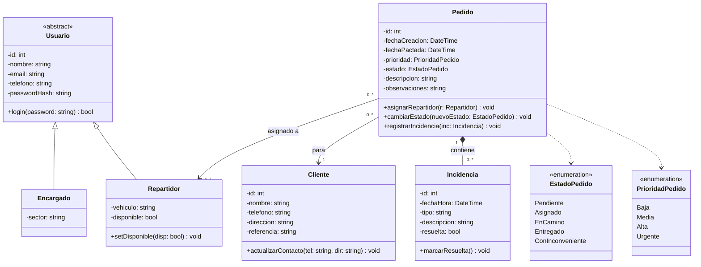

# Ruta Segura - UNAJ

Sistema web para la gestión, asignación y seguimiento de entregas en pequeños comercios y empresas que cuentan con logística propia.

---

## 📌 ¿Qué problema resuelve y quiénes lo usarían?

Pequeños comercios y empresas que realizan sus propias entregas suelen organizar los pedidos mediante WhatsApp, llamadas o anotaciones manuales. Cuando hay varias entregas en curso, resulta complejo saber con precisión qué pedido tiene asignado cada repartidor, cuáles ya fueron entregados y cuáles tuvieron inconvenientes.

### Usuarios del sistema:
* **Encargado / Coordinador de entregas**: Registra clientes y pedidos, asigna las entregas a los repartidores y monitorea los estados e incidencias.
* **Repartidores**: Consultan sus pedidos asignados, actualizan su disponibilidad y el estado de la entrega, y reportan inconvenientes ocurridos en la calle.

---

## 🎯 Alcance del MVP (Mínimo Producto Viable)

### ✅ Funcionalidades Incluidas:
* **Gestión de Clientes**: Registro y actualización de datos de contacto y direcciones con referencias.
* **Gestión de Pedidos**: Alta de pedidos con fecha de creación, fecha pactada, descripción y nivel de prioridad (`Baja`, `Media`, `Alta`, `Urgente`).
* **Asignación y Seguimiento**: Asignación de pedidos a repartidores disponibles y transición de estados (`Pendiente`, `Asignado`, `EnCamino`, `Entregado`, `ConInconveniente`).
* **Registro de Incidencias**: Carga de problemas ocurridos durante el reparto (cliente ausente, dirección errónea, rechazo del pedido, etc.).
* **Consultas y Filtros**: Visualización de pedidos organizados por su estado y ordenados por fecha o prioridad.
* **Control de Acceso**: Autenticación para usuarios autorizados con perfiles diferenciados (`Encargado` y `Repartidor`).

### ❌ Fuera del Alcance (Exclusiones explícitas para el MVP):
* Seguimiento GPS en tiempo real.
* Optimización automática de rutas.
* Integración con mapas interactivos (Google Maps / OpenStreetMap).
* Facturación electrónica y pasarelas de pago.
* Comunicación directa o automatizada con la API de WhatsApp.

---

## 🛠️ Metodología y Tecnologías

* **Metodología**: Scrum, con entregas semanales atadas al calendario de clases y seguimiento mediante tablero en Trello.
* **Lenguaje y Framework**: C# con ASP.NET Core (.NET 9).
* **Persistencia**: Entity Framework Core.
* **Diseño**: Aplicación web responsive.

---

## 📐 Diagrama de Clases UML

---

### Descripción del Diseño UML

1. **Herencia / Generalización (`Usuario <|-- Encargado`, `Usuario <|-- Repartidor`)**:
   `Usuario` es una clase abstracta que provee la lógica común de identidad y autenticación. `Encargado` y `Repartidor` heredan de ella y agregan sus atributos particulares (`sector`, `vehiculo`, disponibilidad).
2. **Composición (`Pedido "1" *-- "0..*" Incidencia`)**:
   Las incidencias tienen una relación todo-parte fuerte con el pedido; solo existen ligadas a un pedido determinado y no tienen sentido de forma huérfana.
3. **Asociación**:
   * `Pedido "0..*" --> "1" Cliente`: Todo pedido está asociado obligatoriamente a un único cliente.
   * `Pedido "0..*" --> "0..1" Repartidor`: Un pedido puede estar sin asignar (`0`) o asignado a un repartidor (`1`). A su vez, un repartidor puede tener varios pedidos a su cargo (`*`).
4. **Dependencia**:
   `Pedido` depende de las enumeraciones `EstadoPedido` y `PrioridadPedido` para tipificar de forma consistente su ciclo de vida y urgencia.